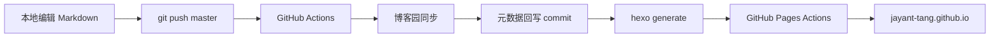

# 架构与运维文档

本文档描述本仓库的发布链路、博客园同步机制，以及日常运维方式。

## 总体架构



> 回写提交带 `[skip ci]`，且 `GITHUB_TOKEN` 推送默认不触发新 workflow，避免循环构建。

两条发布链路在一次 CI 中完成：

1. **GitHub Pages**：`npm run build` 生成 `public/`，通过 `upload-pages-artifact` + `deploy-pages` 发布。
2. **博客园**：将本次 push 中变更的 `source/_posts/*.md` 同步到博客园。

## 日常工作流

CI 负责发布到博客园，并在成功同步后**自动把元数据回写提交到仓库**（commit message 带 `[skip ci]`，避免 workflow 循环触发）。

### 新文章首次发布

1. 在 `source/_posts/` 下写好文章
2. `git add / commit / push`
3. 等 GitHub Actions 完成：
   - 把文章发布到博客园
   - 自动回写 `cnblogs.postId / url / sourceHash` 等到 front matter 和 `.cnblogs/posts-index.json`
   - 以 `chore(cnblogs): backfill metadata [skip ci]` 提交并 push 回仓库

一般不需要再本地手动跑同步脚本。若 CI 不可用，可本地执行：

```bash
python tools/cnblogs/cnblogs_sync.py \
  --workspace-root . \
  --files source/_posts/你的文章.md
```

### 已映射文章后续更新

如果文章已经有 `cnblogs.postId`，后续通常只需要：

1. 改正文
2. `git add / commit / push`
3. 等 CI 自动更新博客园对应文章，并回写最新元数据

若正文与关键元数据未变（`sourceHash` 相同），脚本会跳过远端更新，也不会产生元数据回写提交。

### 不会触发博客园同步的 push

以下变更**不会**进入博客园同步，也不会触发元数据回写：

- 只改了 Hexo 配置、主题、link 页等非文章内容
- 只改了 `.cnblogs/posts-index.json` 或其他 `.cnblogs/` 辅助文件
- push 的 commit 中没有 `source/_posts/*.md` 的 added/modified

### 不发布到博客园的文章

如果某篇文章只想保留在 Hexo，不想同步到博客园，可以设置任意一种：

```yaml
published: false
```

或者：

```yaml
cnblogs:
  published: false
```

脚本会自动跳过这些文章。

## 博客园接口

- **写入/更新文章**：`https://i.cnblogs.com/api/posts` 后台文章接口
- **读取文章列表**：`https://i.cnblogs.com/api/posts/list`，使用 `t=2` 读取“文章（Article）”
- **读取文章详情**：`https://i.cnblogs.com/api/articles/{id}`
- **认证**：优先使用 `CNBLOGS_OPENAPI_TOKEN`（PAT）

## GitHub Secrets

在仓库 `Settings -> Secrets and variables -> Actions` 中配置：

| Secret | 说明 |
| --- | --- |
| `CNBLOGS_BLOG_APP` | 博客园博客标识，通常就是博客地址中的用户名部分，例如 `jayant97` |
| `CNBLOGS_USERNAME` | 博客园登录用户名，**这里要填用户名，不要填邮箱** |
| `CNBLOGS_TOKEN` | 兼容保留；目前主要用于在缺少 `CNBLOGS_BLOG_ID` 时，通过 MetaWeblog 自动解析 blogId |
| `CNBLOGS_BLOG_ID` | 可选；不填时脚本会自动调用 MetaWeblog `getUsersBlogs` 获取 |
| `CNBLOGS_OPENAPI_TOKEN` | **推荐必填**；博客园 PAT，用于文章创建、更新、扫描 |

本地运行脚本时，可在环境变量中设置同名变量。

## 文章元数据

新文章模板里预留了以下字段：

```yaml
cnblogs:
  postType: Article
  postId:
  url:
  lastPublishedAt:
  sourceHash:
  status:
```

字段说明：

- `postId`：博客园文章 ID
- `published`：可选字段；只在需要禁止同步时设为 `false`。不写时默认允许同步，成功发布状态由 `postId / url / lastPublishedAt / sourceHash / status` 回写记录
- `postType`：当前默认为 `Article`
- `url`：博客园文章链接
- `lastPublishedAt`：最近一次成功同步时间
- `sourceHash`：当前本地正文和关键元数据的哈希，用于跳过未变化文章
- `status`：如 `synced`、`imported`

辅助文件：

- `.cnblogs/posts-index.json`：总索引，便于 CI 和批量检查
- `.cnblogs/import-candidates.json`：历史文章匹配候选清单

## GitHub Actions 行为

工作流定义见 [`.github/workflows/main.yml`](../.github/workflows/main.yml)。

### Runner 环境

| 项 | 配置 |
| --- | --- |
| Node.js | 20 |
| Python | 3.12（博客园同步） |
| checkout | `fetch-depth: 0`（保留完整 git 历史，供变更文件回退检测） |
| 时区 | `Asia/Shanghai` |
| npm 缓存 | `actions/cache`，key 为 `package-lock.json` 哈希 |
| build job 权限 | `contents: write`（元数据回写 push 需要） |
| 依赖更新 | `.github/dependabot.yml` 每日检查 npm 依赖 |

### push 到 `master`

1. 从本次 push 的 commit 范围中收集变更的 `source/_posts/*.md`（added / modified）
   - 优先读取 `github.event.commits` 中的文件列表
   - 若 payload 未带文件列表（常见），回退为 `git -c core.quotepath=false diff before..after -- source/_posts`，避免中文文件名被转义后无法匹配路径
2. 若没有文章变更，跳过博客园同步，直接构建并部署站点
3. 若有文章变更，调用 `tools/cnblogs/cnblogs_sync.py` 同步到博客园
4. 若同步导致 front matter 或 `.cnblogs/posts-index.json` 有改动，CI 会以 `[skip ci]` 提交并 push 回仓库；全跳过时不会产生回写提交
5. 同步（或跳过同步）完成后执行 `npm run build`，并通过 GitHub Pages Actions 发布 `public/`

说明：

- CI 使用默认 `--write-back`（写回 front matter 和索引）
- 仅 `cnblogs` 元数据变更、正文未变时，因 `sourceHash` 不包含元数据字段，不会重复发文
- 所有文章均被跳过时，不会改写 `posts-index.json`，也不会产生回写提交

### 手动触发 `workflow_dispatch`

支持三种动作：

- `sync_changed`：同步 `target_paths` 里填写的文章；如果没填，则同步全部文章
- `sync_all`：同步全部文章
- `import_scan`：扫描博客园已发布文章，生成历史映射候选清单，并上传 `cnblogs-import-candidates` artifact

## 本地命令

安装依赖：

```bash
npm install
python -m pip install -r tools/cnblogs/requirements.txt
```

本地预览：

```bash
npm run server
```

### 手动同步指定文章并写回映射

```bash
python tools/cnblogs/cnblogs_sync.py \
  --workspace-root . \
  --files source/_posts/安装nRF-Connect-SDK.md
```

### 扫描历史文章映射

```bash
python tools/cnblogs/cnblogs_import_existing.py scan --workspace-root .
```

### 应用已确认的历史映射

先检查 `.cnblogs/import-candidates.json` 中 `matches` / `conflicts` 的 `decision` 与 `selectedPostId`，然后：

```bash
python tools/cnblogs/cnblogs_import_existing.py apply --workspace-root .
```

## 内容约束

- 当前默认同步到博客园“文章（Article）”，不是“随笔（BlogPost）”
- 文章接口直接以 Markdown 模式提交正文
- 当前保留 `tags`；`categories` 由于后台接口需要 `categoryIds`，暂未自动映射分类 ID
- 图片主要为阿里云 OSS 链接，脚本会原样保留
- 如果文章没有 `cnblogs.postId`，脚本会尝试按标题匹配远端“文章”列表，避免首次接入时重复发文
- 顶层 `published: false` 或 `cnblogs.published: false` 可禁止同步到博客园
- push 时只有 `source/_posts/*.md` 的 added/modified 会进入同步候选

## 仓库迁移说明

本仓库由原 `my-hexo` 源码仓与 `Jayant-Tang.github.io` 部署仓合并而来。部署方式已从 `hexo-deployer-git` 改为 GitHub 官方 Pages Actions，不再向独立部署仓推送静态文件历史。
